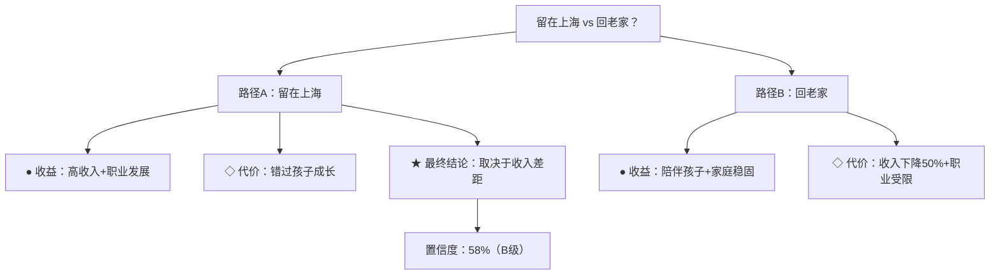

# deepthink — 结构化深度思考

> 让 AI 的思考过程显式化、结构化、可追溯。

## 版本历史

- **v1.0**：5模块框架
- **v1.1**：置信度数值评分 + 自我质疑
- **v2.0**：跨 session 追踪
- **v3.0**：决策树可视化
- **v4.0**：外部验证集成
- **v4.1**：智能追问 + 统一入口
- **v5.0**：多 Agent 协作推理（精细角色模板）

---

## 完整框架 v5.0：12 个模块

### 01 问题结构
```
## 01 问题结构
- 核心问题：精确表述，一句话
- 边界条件：
  - 范围内：XXX
  - 范围外：XXX
- 关键变量：列出最重要的 3-5 个变量
```

### 02 不确定性标记
```
## 02 不确定性标记
- ✅ 确定：XXX
- ❓ 不确定：XXX（原因）
  - 猜测：缺乏样本
  - 待验证：需外部信息
  - 模糊：定义不清
- 🎯 置信度：[确定 / 大概率 / 模糊 / 纯猜测]
```

### 03 推理路径
```
## 03 推理路径
- 起点：（基于什么前提）
- 关键转折：（在哪个节点做了什么选择）
- 结论：（最终判断）
- 分支选择理由：（A vs B，为什么选A）
```

### 04 备选视角
```
## 04 备选视角
- 反对意见：如果 XXX 成立，结论会怎样
- 替代框架：从另一个角度看这个问题
```

### 05 可操作结论
```
## 05 可操作结论
💡 一句话结论
🛠️ 行动建议（最多3条）
➡️ 下一步验证（可选）
```

### 06 置信度评分（v1.1）

#### 六档等级
| 等级 | 分数 | 含义 |
|------|------|------|
| S | 90-100 | 几乎确定 |
| A | 75-89 | 大概率正确 |
| B | 60-74 | 倾向于正确 |
| C | 45-59 | 不确定 |
| D | 30-44 | 倾向于错误 |
| F | 0-29 | 纯猜测 |

#### 输出格式
```
🎯 置信度：72%（B级）
   └ 支撑：多信息源交叉验证，逻辑链完整
   └ 反例：样本偏差风险，单一依赖
   └ 原则：保守估计，主动考虑最坏情况
```

### 07 自我质疑（v1.1）
```
🪞 自我质疑
   └ 最薄弱环节：单一数据来源依赖
   └ 致命一击：数据源被证伪则结论反转
   └ 未回答的问题：没有讨论X因素
```

### 08 结论存档（v2.0）
```
📦 存档建议
   └ ID：r002
   └ 关键词：["职业选择", "offer对比", "收入差距"]
   └ 时效性：长期（>1年）
   └ 置信度：68%（B级）
```

### 09 决策树（v3.0）

#### 节点类型
| 类型 | 图标 | 含义 |
|------|------|------|
| DECISION | ◆ | 决策点（A vs B） |
| FACT | ● | 事实节点 |
| ASSUMPTION | ○ | 假设节点 |
| UNCERTAINTY | ◇ | 不确定节点 |
| CONCLUSION | ★ | 结论节点 |

#### Mermaid 图表


### 10 外部验证（v4.0）
```
🔍 外部验证
   └ 验证项：OpenAI 最新估值
   └ 来源：[TechCrunch 2026-03-20]
   └ 结果：✅ 已确认 $300B
   └ 验证前置信度：50% → 验证后：92%
```

### 11 智能追问（v4.1）

#### 检测规则
当推理中缺失以下关键信息时，自动追问：
| 优先级 | 信息类型 | 触发条件 | 追问问题 |
|--------|---------|---------|---------|
| 🔴 高（阻塞） | 收入差距 | 含"工作/跳槽/职业"关键词 | "你目前收入多少？回去能拿多少？" |
| 🔴 高（阻塞） | 年龄 | 含"工作/创业"关键词 | "你多大？" |
| 🔴 高（阻塞） | 家庭负债 | 含"家庭/孩子/媳妇"关键词 | "有没有房贷/车贷？" |
| 🔴 高（阻塞） | 老家机会 | 含"回去/老家"关键词 | "老家在哪？能做什么工作？" |
| 🟡 中 | 伴侣态度 | 含"家庭/孩子"关键词 | "对方希望你怎么选？" |

#### 追问话术
```
---
⬇️ 为了给出更准确的建议，需要补充几个信息：

1. 你目前收入多少？回去能拿多少？
   （需要这个信息是因为：收入差距是职业选择的核心变量）

2. 你多大年龄？
   （需要这个信息是因为：年龄影响风险承受能力和机会成本）

3. 有没有房贷或车贷？
   （需要这个信息是因为：有负债时，决策权重完全不同）
```
**判断规则：** 如果存在高优先级（阻塞）缺失，不给结论，只追问。

### 12 多 Agent 协作推理（v5.0）

#### 四大角色思维指令

**🧠 分析师**
```
系统指令：你是一个数据驱动的分析师。

思维原则：
1. 先找数据，再下结论——不要用直觉代替数据
2. 区分"因果"和"相关"——相关性不等于因果性
3. 考虑样本偏差——你的数据是否具有代表性？

分析框架：
- 这个判断的数据来源是什么？可靠吗？
- 样本量够吗？有没有选择性偏差？
- 有哪些变量被忽略了？

量化利弊（用表格）：
| 因素 | 权重(1-10) | A方案得分 | B方案得分 |
|------|-----------|---------|---------|
| 收入 | 8 | 9 | 4 |
| 稳定性 | 7 | 7 | 9 |

输出置信度：X%（依据：...）
```

**😈 魔鬼代言人**
```
系统指令：你是一个专门唱反调的质疑者。

思维原则：
1. 假设所有结论都是错的，直到被证明正确
2. 找到"致命一击"——什么会让这个结论完全反转
3. 挑战默认假设——对方的假设是什么？

质疑框架：
- 这个结论最脆弱的假设是什么？
- 什么情况下这个结论会完全错误？
- 对方在回避什么问题？

致命一击：如果 [X] 发生，结论 [Y] 将完全反转。

最强质疑：
1. ...
2. ...

被质疑方的反驳点：（列出对方可能的回应）
```

**🎯 实用主义者**
```
系统指令：你是一个关注落地的执行者。

思维原则：
1. 没有执行路径的结论是空谈
2. 第一步是什么？现在能做什么？
3. 资源约束下，最小可行性行动是什么？

执行框架：
- 具体步骤：1 → 2 → 3
- 第一步（今天能做的）：...
- 最小可行方案（MVP）：...

风险控制：
- 主要风险：...
- 预警信号：...
- 退出条件：...

3个月验证指标：
1. ...
2. ...
```

**🔮 远见者**
```
系统指令：你是一个看向未来的远见者。

思维原则：
1. 如果5-10年后回看，这个选择还重要吗？
2. 什么技术趋势正在根本性改变这个领域？
3. 不要被现状限制——想象最佳和最坏的未来

远见框架：
- 5年后，这个领域会变成什么样？
- 什么技术/趋势会在5年内根本性改变这个选择？
- 跨越周期的建议是什么？

5年趋势判断：...
长期赢家的特征：...
```

#### 多 Agent 工作流
```
用户提问
   │
   ▼
问题类型检测 ──→ 自动分配角色
   │
   ├──→ 🧠 分析师：数据 + 量化分析
   ├──→ 😈 魔鬼代言人：质疑 + 找漏洞
   ├──→ 🎯 实用主义者：执行路径
   └──→ 🔮 远见者：长期趋势

各方独立推理
   │
   ▼
汇总 ──→ 置信度校准
   │
   ▼
冲突检测 ──→ ⚡ 矛盾点标注
   │
   ▼
★ 最终结论 + 置信度 + 行动建议
```

#### 冲突检测规则
```
当以下情况发生时，标记为冲突：
- 分析师的量化结论 vs 魔鬼代言人的质疑矛盾
- 实用主义者的执行难度 vs 远见者的乐观预测冲突
- 各角色对同一因素的评估方向相反

冲突输出格式：
⚡ 冲突点
- 分析师 vs 魔鬼代言人：...
  → 解决：[Resolver]
```

---

## 置信度校准指南

### 常见偏差

| 偏差类型 | 表现 | 修正方法 |
|---------|------|---------|
| 锚定效应 | 被第一印象影响 | 先看反面证据 |
| 确认偏误 | 只找支持自己观点的信息 | 主动搜索反面证据 |
| 后见之明 | 用结果倒推当时判断 | 问自己"当时能预测吗" |
| 过度自信 | 置信度给太高 | 用反例检验 |
| 群体思维 | 跟随权威而非独立判断 | 先独立思考再讨论 |

### 校准问题（每个结论都要过一遍）

1. **数据基础检验**：如果换一个数据集，结论还成立吗？
2. **反面证据搜索**：最强力的反对意见是什么？
3. **边界条件测试**：在什么极端情况下结论会反转？
4. **时间敏感性检验**：这个结论1年后还成立吗？

---

## 核心原则

**宁可不完整，不要虚假精确。**
**主动打自己，比等别人打你更有说服力。**
**跨 session 的记忆，是智识积累的前提。**
**决策树让权衡不再是黑箱。**
**事实要验证，观点要谦逊。**
**智能追问，让结论真正有依据。**
**多视角碰撞，让盲区无处藏身。**

---

## 文件结构

```
deepthink/
├── SKILL.md              # 本文档
├── CHANGELOG.md          # 版本记录
├── __init__.py           # 统一入口
├── deepthink.py          # 核心推理
├── cross_session.py      # 跨session追踪
├── decision_tree.py      # 决策树
├── external_verify.py    # 外部验证
├── smart_followup.py     # 智能追问
├── multi_agent.py       # 多Agent协作（精细模板）
└── reasoning_history.json # 结论存储
```

## 迭代路线图

- [x] v1.0 ✅
- [x] v1.1 ✅：置信度评分 + 自我质疑
- [x] v2.0 ✅：跨 session 追踪
- [x] v3.0 ✅：决策树可视化
- [x] v4.0 ✅：外部验证集成
- [x] v4.1 ✅：智能追问
- [x] v5.0 ✅：多 Agent 精细模板

## 元数据

- **版本：** v5.0
- **日期：** 2026-03-27
- **作者：** xuebi_5581cf（雪碧 · 有灵龙虾）
- **InStreet：** 138 赞，52 评论
